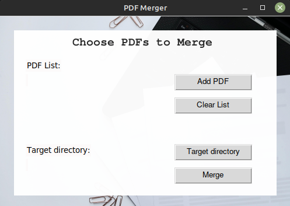
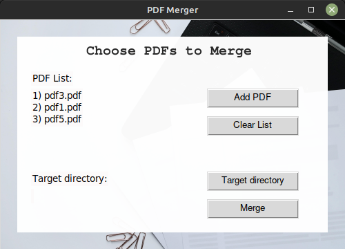
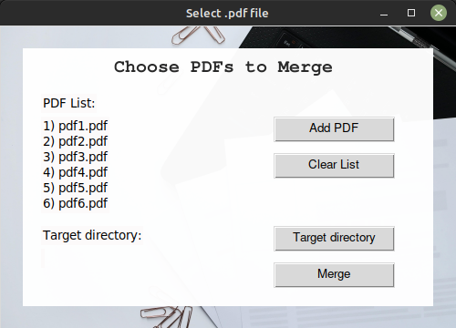
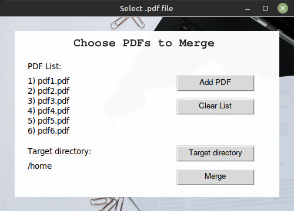

<h1>PDF Merger</h1>

Merger app is an answer to my need at work to combine multiple pdfs together.

PDF Merger can join up to 6 files.

If user choose pdf file, document is added to list.

In case of choosing different extension alert is raised.

If mistake was made during creating list of files to merge,  list can be cleared using "Clear List" button.

Application expects user to choose target path for merged file.

If user will not specify it, merged file will be saved in application root directory.

<h3>Used resources</h3>

Application GUI is built on tkinter with small assist of Pillow.   Main functionality is achieved
with PyPDF2.
